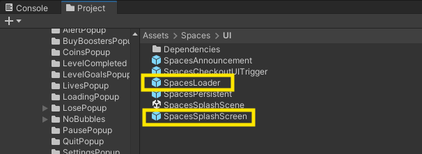
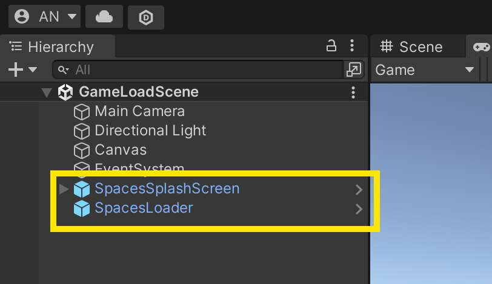
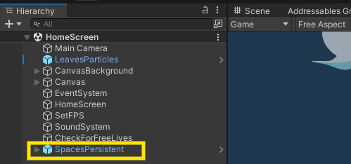
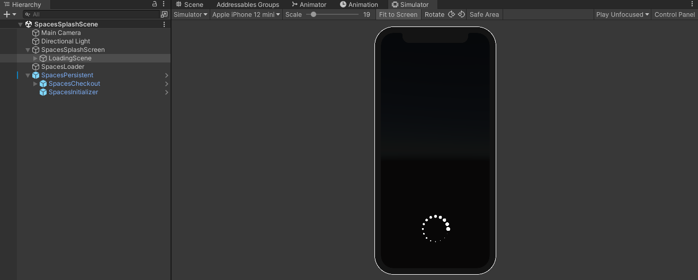

# Spaces Life Cycle

The Spaces Ad-Engine follows lifecycle states that must align with your game's lifecycle, including **game-load**, **game-initialize**, **game-start**, **game-pause**, **game-resume**, and **game-end**.

## LOAD

Let's start with the very first scene of your game, the Loading Scene or Splash Screen.

### If Your Game Already Has a Loading Scene
1. Drag and Drop ```SpacesSplashScreen``` prefab at the bottom of the hierarchy in your Loading Scene. You can find it at ```\Spaces\UI```
2. Drag and Drop ```SpacesLoader``` prefab at the bottom of the hierarchy in your Loading Scene. You can find it at ```\Spaces\UI```



3. Drag and Drop  ```SpacesPersistent``` prefab at the bottom of the hierarchy in your Loading Scene. You can find it at ```\Spaces\UI```



4. Call the `SpacesController.Load()` function in your game-loading logic. You need to place it at the very beginning of your game, before your game loading logic starts. (Note that this should specifically be before any addressables Loading if you have any).
5. Ensure that the game starts only after the execution of the `SpacesController.Load()` function. Convert the parent function where you include `SpacesController.Load()` into an `async Task` function.

**Example**
```csharp
using System.Threading.Tasks; // Add this library to support async functions

public async Task YourLoadingFunction(){
    // ---Place this code before at the beginnig before any game logic--- 
    await SpacesController.Load();
    // --- Rest of you code-------------------
}
```

6. If in case, you cannot convert the parent function into ```async Task``` (eg: your parent is a Coroutine). In that case just place the above code into a separate ```async``` function and call the new function in the place where you trigger or load the next game scene.

**Example**
```csharp
using System.Threading.Tasks; // Add this library to support async functions

//Create a function like below
public async Task TriggerSpacesLoad(){
    await SpacesController.Load();
}

public void YourLoadingFunction(){
    //Instead of Triggering the next Scene here, call the function that you created. 
    TriggerSpacesLoad();
}
```
7. ```await SpacesController.Load;``` will also trigger a Loading Screen from ```SpacesSplashScreen```. If you want to disable it, You can comment out ```SpacesController.SpacesSplashLoadingScreenOn();``` and ```SpacesController.SpacesSplashLoadingScreenOff();``` within the ```Load()``` function in ```SpacesLoader.cs```



**In SpacesLoader.cs**

```csharp
public class SpacesLoader : MonoBehaviour
{
    public async Task Load()
    {
        Debug.Log("Spaces: Load");
        SpacesController.SpacesSplashLoadingScreenOn(); //Comment this line to disable the LoadingScreen from Spaces in your Loading Scene
        //----rest of the code---//
        SpacesController.SpacesSplashLoadingScreenOff(); //Comment this line to disable the LoadingScreen from Spaces in your Loading Scene
    }
}
```


### If Your Game Does Not Have a Loading Scene
A basic loading scene is provided. Add it to your buil settings hierarchy above your game scene. You can find it at `./Assets/Spaces/UI/SpacesLoader.Unity`.


Feel free to modify the loading screen UI as needed. By default, the scene includes a background image with a loading icon.

1. Trigger the scene you want to load at the end of the `Initialize()` function in `SpacesLoaderInScene.cs`. You can find this script in `./Assets/Spaces/Scripts/`.

```csharp
private async Task Initialize(double lat, double lon, string deviceId, string defaultDeviceId)
{
    // ---Rest of the code---
    await spacesEngine.Load(); 
    await SpacesController.StartGameSession();  
    SceneManager.LoadScene("Main"); // Trigger your game scene here 
}
```

## UPDATE
Typically, your game will show a "Game Over" screen at some point in the game cycle. Just before this screen appears, you must trigger `SpacesController.UpdateGameSession();` This will display the Spaces UI if there is an active campaign.

1. Call the `SpacesController.UpdateGameSession();` function in the appropriate location, just before the "Game Over" screen is displayed.
2. Convert the parent function where you include `SpacesController.UpdateGameSession();` into an `async Task` function. 

```csharp
using System.Threading.Tasks; // Add this library to support async functions

public async Task YourFunction(){
    // ---Rest of your code--- 
    await SpacesController.UpdateGameSession();
    // ---Rest of your code--- 
}
```

During an active campaign, the Spaces UI, called SpacesCheckout UI, will be displayed. This UI allows brands to distribute rewards for in-game task completion, showcase call-to-action buttons, display a brand banner or video, and more.

This UI should be customized to align with your game's UI/UX. Details on customization will be covered in the upcoming steps.

### Next...
We will link the Spaces Engine with your assets. From this step onwards, in most cases, integration involves only drag-and-drop actions, making it straightforward.
